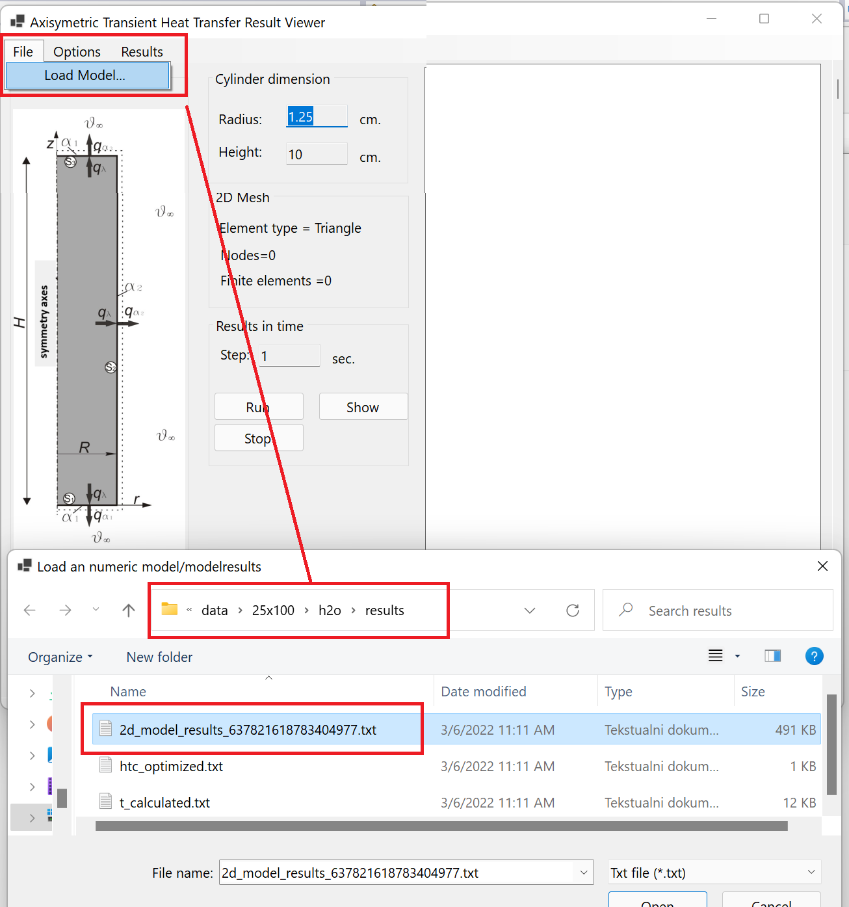

# A new multi-objective optimization approach for process parameters optimization during numerical simulation of quenching steel parts 
Authors:
Bahrudin Hrnjica,Sefik Behrem, Faculty of Engineering, University of Bihac.

doi:

Journal: Advances in Production Engineering & Management
         Volume 17 | Number 1 | March 2022 

## Paper Summary:

The paper presents the numerical simulation of quenching a cylindrical sample of steel immersed in three different quenchants: water, 5% of aquatensid solution and isorapid oil. The quenching process starts from the initial temperature of the cylinder at 850 °C and then it moves through the air until it reaches the quenching bath. The quenchant is held at constant temperature of 400C. The cylinder is made of carefully selected steel which does not change its structure during quenching and heating. Cylindrical samples were manufactured in three different dimensions (R, H) [mm]: (12.5x100), (25x150) and (37.5x225) so that in each sample four measuring points were installed. Each measuring point consists of thermocouple installed beneath the cylinder surface capable of measuring the temperature every half second. Based on the experiment, the numerical simulation is recognized as transient and nonlinear two-dimensional heat conduction problem consisted of the two main tasks: direct heat transfer problem (DHTP) and inverse heat transfer problems (IHTP). 
The paper proposes a new multi-objective optimization approach for the estimation of heat transfer coefficients during the numerical simulation of quenching cylindrical steel sample. The proposed approach gained better results and less convergence time compared to the results from the litera-ture. The paper includes methods, algorithms and the source code for the calculation of the temperature fields in time and heat transfer coefficient estimation of the IHTP. 

## Software requirements
In order to run the simulation `.NET 6` must be installed on OS (Windows or Linux). The instruction can be found at https://dotnet.microsoft.com/

## How to run the code

In order to run the code the following steps should be performed:

1. Clone repository at your local disk by using command: `git clone https://github.com/bhrnjica/quenching_simulation.git`
2. Enter the directory `cd quenching_simulation`
3. Run build command depending on the OS:
   1. For Windows:  `dotnet restore qs-windows.sln` then `dotnet build qs-windows.sln`
   2. For Linux:  `dotnet restore qs-linux.sln` then `dotnet build qs-linux.sln`
4. Run the simulation with one of the supported command line args:
   1. For Windows: `dotnet run --[DxH] --[quenchant] --project qs-windows.csproj`,
   2. For Linux: `dotnet run --[DxH] --[quenchant] --project qs-linux.csproj`

Supported arguments
-  for cylinder dimensions are:
`[DxH]= all, 25x100, 50x150, 75x225`.
- for quenchants: `[quenchant]=H2O, aquatensid5%, isorapid`

5. Once the simulations are calculated the result can be shown by command:
   1. For Windows:  `dotnet run --[DxH] --[quenchant] --result --project qs-windows.csproj`,
   2. For Linux: `dotnet run --[DxH] --[quenchant] --result --project qs-linux.csproj`.

## Examples

The following command run the simulation for cylinder 50x150 with Aquatensid5% in Windows: `dotnet run --50x150 --aquatensid5% --project qs-windows.csproj`

Run similar command to view results only on Linux: `dotnet run --50x150 --aquatensid5% --result --project qs-linux.csproj`

# Show Temperature field using `ResultViewer` 

Run the following command in order to show `ResultViewer` - the windows forms applicaton which can show the temperature field of the axysymmetric profile.
`dotnet run --project .\ResultViewerWnd\ResultViewer.csproj`

From the File menu select Load Model and then select the results from the data folder:

Once the model is loaded, press `Run` button and start the simulation of the temperature field.